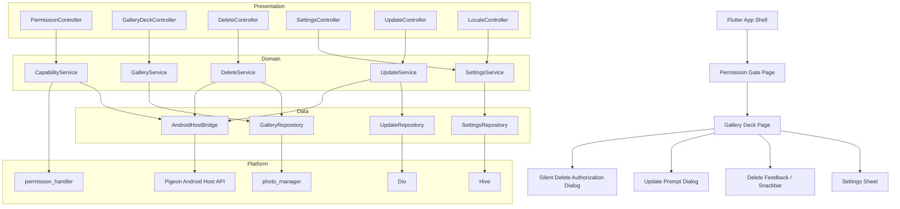

# Photo Roulette Flutter Architecture

## 1. Goal

Rebuild the current Android app as a Flutter application with:

- feature-sliced structure
- typed state management
- Android-specific behavior isolated behind platform bridges
- a migration protocol that preserves every current business rule

The current native codebase is effectively:

- single entry `MainActivity`
- one large `MainViewModel` split across helper files
- repositories for media, settings, and app update
- Compose UI, not legacy XML UI

So the Flutter target should not copy the old shape 1:1. It should split the large ViewModel into feature controllers while preserving runtime behavior.

## 2. Technology Stack

### Final selection

| Concern | Choice | Why this choice |
| --- | --- | --- |
| State management | `flutter_riverpod` | Mature, explicit, testable, better fit than classic Provider for large state graphs |
| Dependency injection | Riverpod provider graph | Avoids adding `get_it` indirection; dependencies stay explicit and AI-friendly |
| Network | `dio` | Mature interceptor model, cancellation, download support, easy error mapping |
| Local storage | `hive` + `hive_flutter` | Simpler than SQLite for current settings/cache use cases, easier for AI to generate safely |
| Routing | `go_router` | Stable declarative routing for app shell and nested flows |
| Gallery/media access | `photo_manager` | Mature cross-platform gallery API for list/query/delete flows |
| Permissions | `permission_handler` | Standard Flutter permission wrapper |
| Platform bridge | `pigeon` | Typed host APIs for Android-only features like silent delete and APK install |

### Why Riverpod over Provider

- The current app already has many concurrent state streams.
- Riverpod scales better for split controllers than plain Provider.
- Riverpod can serve both state and dependency injection, which removes one framework layer.

### Why Hive over SQFlite

The current app mostly persists:

- user settings
- language choice
- swipe mappings
- deferred update version
- silent delete authorization metadata

These are key-value or small structured documents, not relational queries. Hive keeps the migration smaller and more automatable.

If a future version adds analytics history or complex local search, the repository layer can later be swapped to `sqflite` without touching UI/controllers.

## 3. Target Architecture Diagram

## 4. Feature Slices

### App shell

- startup/bootstrap
- theme
- localization bootstrap
- router
- capability registration

### `features/permissions`

- permission status
- rationale page
- settings jump
- Android 14 partial/full media permission handling

### `features/media`

- gallery query
- smart shuffle
- media card models
- image/video/live-photo display
- preload policy

### `features/deck`

- visible card stack
- next/previous/skip
- gesture thresholds
- overlay controls

### `features/delete`

- optimistic card dismissal
- delete protection toggle
- system delete request serialization
- delete reminder snackbar
- silent delete authorization state

### `features/settings`

- all toggles and sliders
- swipe direction action mapping
- default behavior notice mode
- locale selection

### `features/update`

- GitHub release check
- deferred version policy
- APK download/install
- error feedback

## 5. Native-to-Flutter Translation Protocol

### 5.1 Generic mapping

| Native Android concept | Flutter target |
| --- | --- |
| `Activity` | route entry page plus one coordinator widget for lifecycle/effects |
| `Fragment` | nested page, section widget, or `ShellRoute` child |
| `DialogFragment` | `showDialog` or `showModalBottomSheet` |
| `ViewModel` | Riverpod `Notifier` / `AsyncNotifier` with immutable state |
| `LiveData` / `StateFlow` | provider state exposed to widgets |
| one-shot events | effect stream provider listened with `ref.listen` |
| XML layout | widget tree with `Column`, `Row`, `Stack`, `Padding`, `Align`, `CustomPainter`, `Sliver*` |
| Compose composable | Stateless/Consumer widget or extracted render widget |
| Repository | data source + repository interface in feature/data layer |
| Android utility singleton | Dart service or platform bridge wrapper |

### 5.2 Project-specific mapping

| Current native file | Flutter target |
| --- | --- |
| [`MainActivity.kt`](/d:/project/photoRoulette/src/main/java/com/example/photoroulette/app/MainActivity.kt) | `app/bootstrap/app_bootstrap.dart` + `features/permissions/presentation/permission_gate_page.dart` + platform intent coordinator |
| [`MainViewModel.kt`](/d:/project/photoRoulette/src/main/java/com/example/photoroulette/viewmodel/MainViewModel.kt) | split into `PermissionController`, `GalleryDeckController`, `DeleteController`, `SettingsController`, `UpdateController` |
| [`MediaRepository.kt`](/d:/project/photoRoulette/src/main/java/com/example/photoroulette/data/media/MediaRepository.kt) | `features/media/data/gallery_repository_impl.dart` |
| [`SettingsRepository.kt`](/d:/project/photoRoulette/src/main/java/com/example/photoroulette/data/datastore/SettingsRepository.kt) | `features/settings/data/settings_repository_impl.dart` |
| [`AppUpdateRepository.kt`](/d:/project/photoRoulette/src/main/java/com/example/photoroulette/data/update/AppUpdateRepository.kt) | `features/update/data/github_release_repository.dart` |
| [`IntentHelper.kt`](/d:/project/photoRoulette/src/main/java/com/example/photoroulette/utils/IntentHelper.kt) | `features/delete/domain/delete_service.dart` + `platform/android_host_bridge.dart` |
| [`PermissionHelper.kt`](/d:/project/photoRoulette/src/main/java/com/example/photoroulette/utils/PermissionHelper.kt) | `features/permissions/domain/permission_service.dart` |
| [`AppLanguageManager.kt`](/d:/project/photoRoulette/src/main/java/com/example/photoroulette/utils/AppLanguageManager.kt) | `features/settings/domain/locale_service.dart` |
| Compose `MainScreen*` files | Flutter widget tree under `features/deck/presentation/` and `features/settings/presentation/` |

### 5.3 Activity/Fragment mapping rule

If more old native pages appear later:

- one Activity with full-screen responsibility becomes one route page
- one Fragment embedded in a screen becomes one section widget or nested route
- transient permission/update/delete prompts stay as dialog coordinators, not standalone pages

For this repo specifically:

- `MainActivity` becomes the only shell route
- permission rationale becomes an overlay/page state
- settings stays as a sheet/panel inside the main experience
- update prompt and silent delete guide stay dialog-level flows

### 5.4 ViewModel translation rule

Do not recreate one giant `MainViewModel` in Dart.

Use this split:

- `PermissionController`
  - owns permission mode
  - owns rationale visibility
  - owns app-settings navigation trigger
- `GalleryDeckController`
  - owns queue ids
  - owns current index
  - owns visible cards
  - owns preload orchestration
- `DeleteController`
  - owns optimistic dismiss/restore
  - owns serialized system delete requests
  - owns silent delete request state
  - owns delete reminder effect
- `SettingsController`
  - owns all toggles/sliders/language/swipe mappings/default notice mode
- `UpdateController`
  - owns release lookup, defer logic, download/install flow

### 5.5 XML layout translation rule

This repo currently uses Compose, but for any remaining native XML modules the migration rule is:

- flatten nested LinearLayouts into `Column` / `Row`
- translate `ConstraintLayout` only when really needed; otherwise prefer `Stack`, `Align`, and `Expanded`
- move dimensions/colors/typography into `ThemeExtension` or `AppSpacing/AppColors`
- convert imperative view mutation into state-driven widget branches
- convert `View.GONE/INVISIBLE/VISIBLE` into widget inclusion or `Visibility`
- replace adapter-based lists with `ListView.builder` / `SliverList`

## 6. Cross-Platform Capability Strategy

| Capability | Shared Dart | Android | iOS |
| --- | --- | --- | --- |
| Gallery query | Yes | `photo_manager` | `photo_manager` |
| Permission flow | Yes | partial/full media permission logic | iOS photo permission mapping |
| Gesture deck | Yes | same | same |
| Regular delete | Mostly | platform delete request | platform delete request |
| Silent delete by tree URI | No | Android host bridge only | unsupported |
| APK self-update install | No | Android host bridge only | unsupported; replace with App Store/open link strategy |

## 7. Recommended Migration Order

### Phase 0. Foundation

- app shell
- Riverpod provider graph
- error/result model
- localization scaffold
- theme tokens

### Phase 1. Read-only parity

- permission gate
- media query
- smart shuffle
- card deck rendering
- next/previous/skip

### Phase 2. Safe mutation

- swipe delete enable switch
- optimistic dismiss/restore
- system delete confirmation queue
- delete reminder

### Phase 3. Settings parity

- all toggles/sliders
- swipe action mapping
- default behavior notice monthly policy
- language switch

### Phase 4. Android-specific advanced features

- silent delete directory authorization
- authorized path matching
- GitHub update check
- APK download/install bridge

### Phase 5. Parity hardening

- golden tests
- platform contract tests
- behavior checklist sign-off
- production rollout

## 8. Dependency Validation Links

- Riverpod: https://pub.dev/packages/flutter_riverpod
- Dio: https://pub.dev/packages/dio
- Hive: https://pub.dev/packages/hive
- Hive Flutter: https://pub.dev/packages/hive_flutter
- go_router: https://pub.dev/packages/go_router
- photo_manager: https://pub.dev/packages/photo_manager
- permission_handler: https://pub.dev/packages/permission_handler
- Pigeon: https://pub.dev/packages/pigeon
