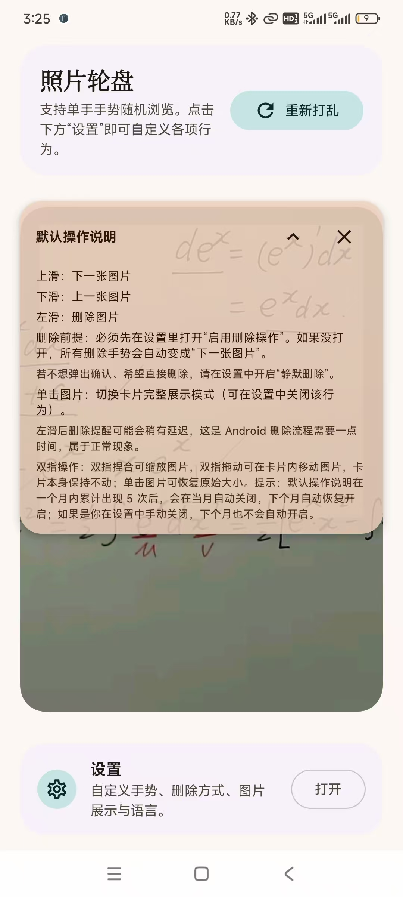
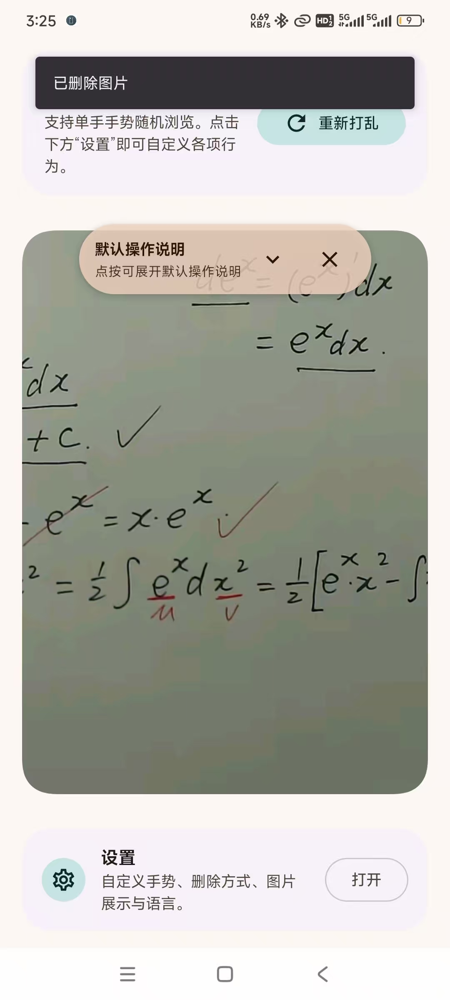
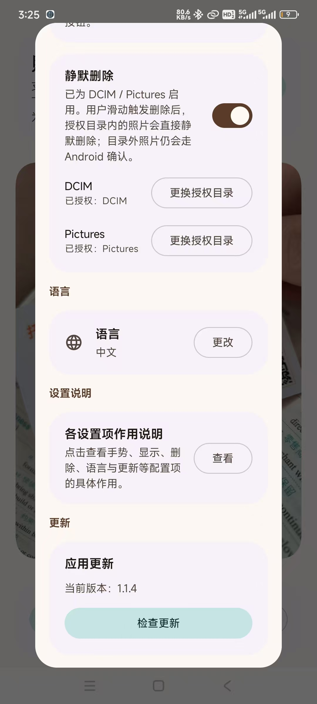
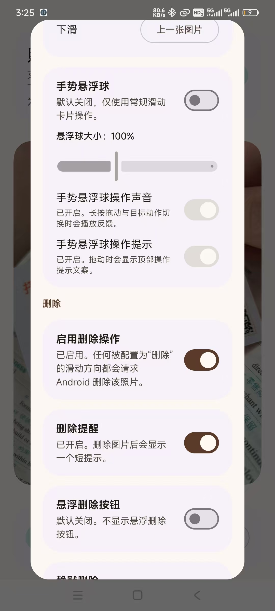
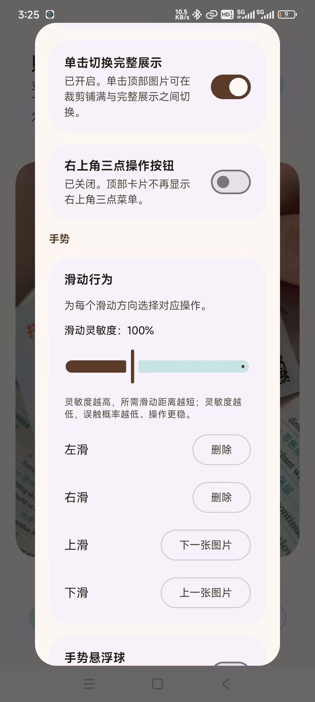
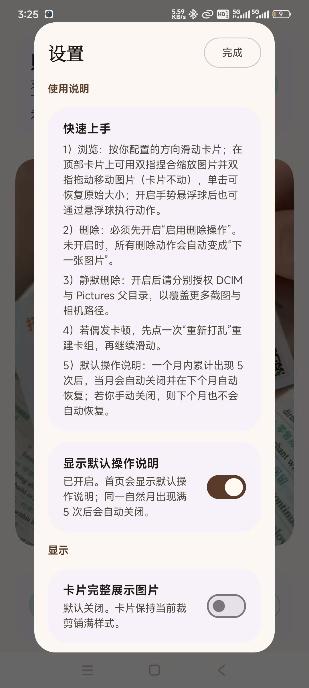

# 照片轮盘 / Photo Roulette

[中文](#中文) | [English](#english)

## 中文

照片轮盘是一款轻量的 Android 相册随机浏览应用，主打单手手势快速筛图。

安卓安装包下载：https://github.com/JaneJane123654/photoRoulette/releases

### 适用场景

- 碎片时间快速清理截图。
- 旅行拍摄后，快速删掉废片。
- 随机翻看旧照片，找回记忆和灵感。
- 云备份前先做一轮精简。

### 主要功能

- 随机卡组浏览，可自定义四方向手势动作。
- 删除保护 + 授权目录内静默删除。
- 手势悬浮球与悬浮删除按钮。
- 多语言界面（中文、英文、阿拉伯语、西班牙语、法语、俄语）。
- 默认操作说明智能显示策略：
  - 同一自然月出现满 5 次后自动关闭。
  - 若为自动关闭，下个月自动恢复。
  - 若为用户手动关闭，下个月仍保持关闭。
- 基于 GitHub Release 的更新能力：
  - 每次打开应用自动检查更新。
  - 支持“有更高版本再提醒我”。
  - 设置页提供“检查更新”按钮。

### 隐私说明

- 所有照片处理都在本地完成。
- 不上传云端。
- 权限范围严格遵循 Android 系统授权。

---

## English

Photo Roulette is a lightweight Android app for quickly browsing your gallery with one-hand gestures.

APK Download:https://github.com/JaneJane123654/photoRoulette/releases

### Best Use Cases

- Clean up screenshot folders during short breaks.
- Quickly review travel photos and remove low-quality shots.
- Shuffle through old memories for random inspiration.
- Decide what to keep before cloud backup.

### Core Features

- Random photo deck browsing with configurable swipe actions.
- Delete protection mode and optional silent delete for authorized folders.
- Gesture floating ball and floating delete button.
- Multi-language UI (English, Chinese, Arabic, Spanish, French, Russian).
- Smart default-control guide visibility:
  - Auto-hides after appearing 5 times within the same month.
  - Automatically re-enables next month if it was auto-hidden.
  - Stays off next month if user turned it off manually.
- GitHub Release based update check:
  - Checks on app launch.
  - Supports "remind me when a newer version than this one exists".
  - Manual "Check updates" button in Settings.

### Privacy

- All photo operations happen on-device.
- No cloud upload.
- Access scope follows Android permission system.

---

## 截图展示 / Screenshots

